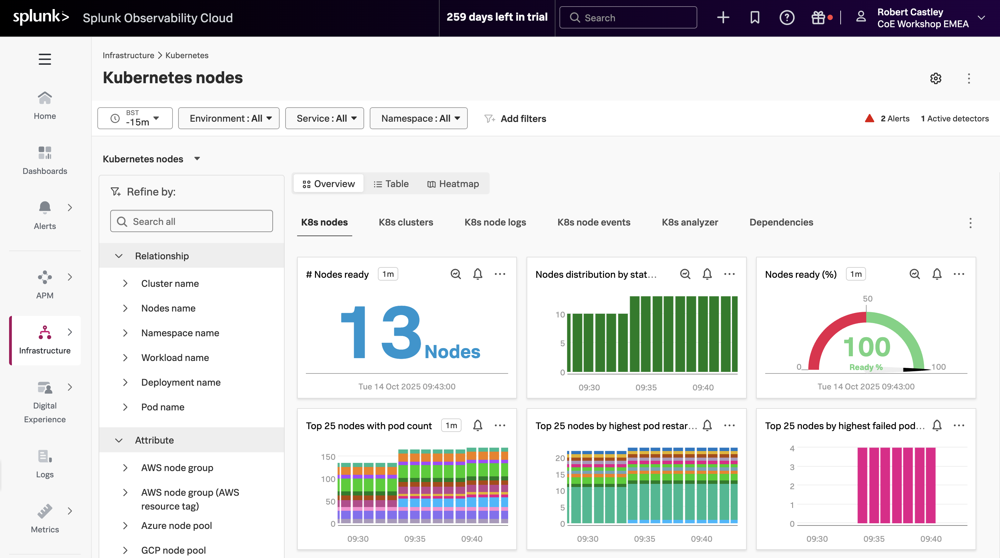
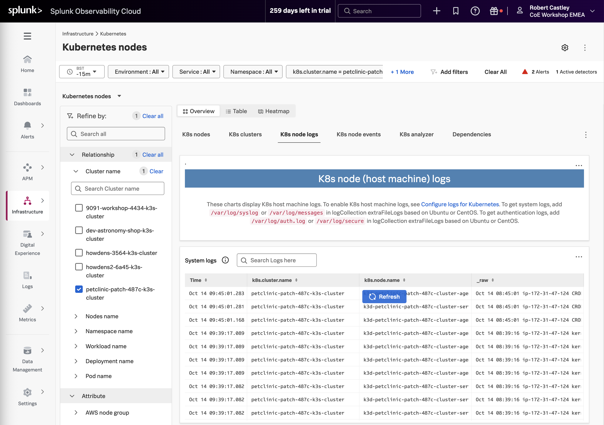

Once the installation has completed, you can log in to **Splunk Observability Cloud** and verify that the metrics are flowing in from your Kubernetes cluster.

From the left-hand menu, click on **Infrastructure** and select **Kubernetes**, then select the **Kubernetes nodes** tile.

Once you are in the **Kubernetes nodes** overview, change the **Time** filter from **-4h** to the last 15 minutes **(-15m)** to focus on the latest data, then select **Table** to list all the nodes that are reporting metrics.

Next, from the list of nodes, select the **Node name** of your workshop instance.

{}
To identify your specific cluster, use the `INSTANCE` value from the shell script output you ran during setup. This unique identifier helps you locate your workshop cluster among other nodes in the list.
{}

You will now only have your cluster visible. Scroll down the page to see the metrics coming in from your cluster. Locate the **Node log events rate** chart and click on a vertical bar to see the log entries coming in from your cluster.

