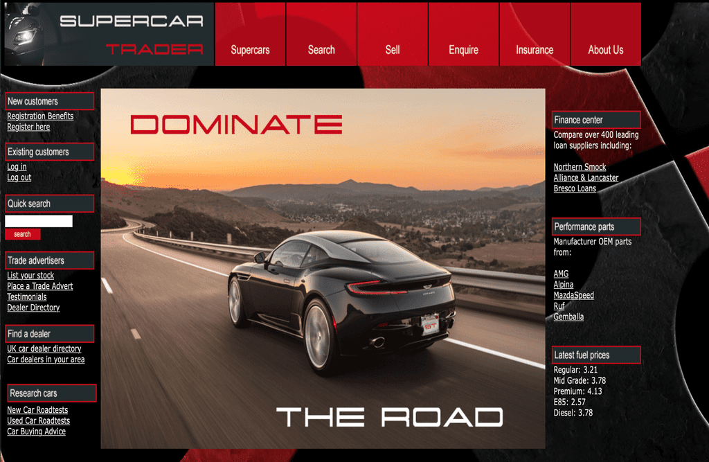
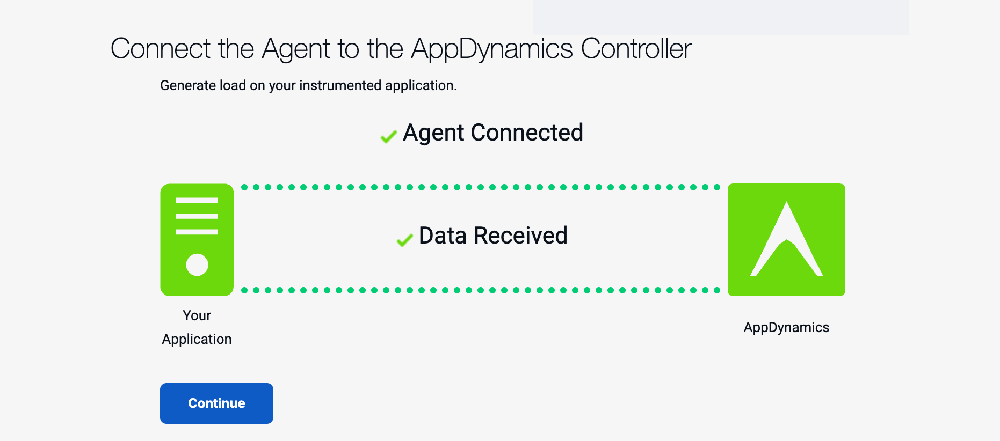
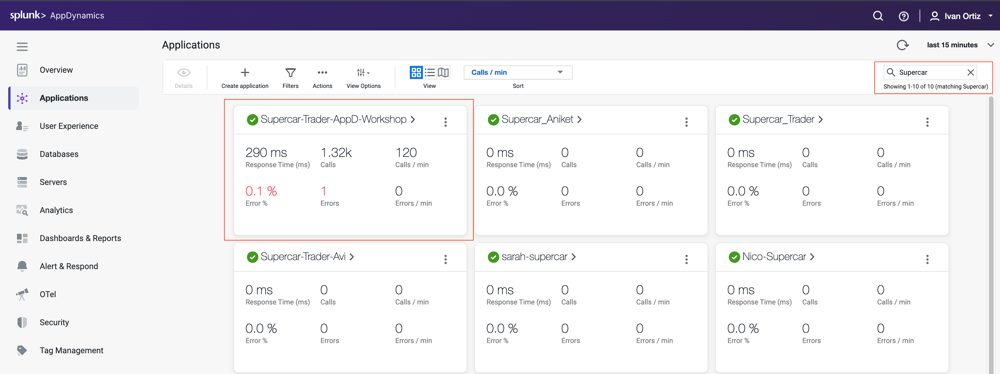

In this exercise you will perform the following actions:

* Verify the sample app is running.
* Start the load generation for the sample application.
* Confirm the transaction load in the Controller.

## Verify that the Sample Application is Running

The sample application home page is accessible through your web browser with a URL in the format seen below. Enter that URL in your browser’s navigation bar, substituting the IP Address of your EC2 instance.

```bash
http://[ec2-ip-address]:8080/Supercar-Trader/home.do
``` 

You should be able to see the home page of the Supercar Trader application.


## Start the Load Generation

SSH into your ec2 instance and start the load generation. It may take a few minutes for all the scripts to run. 


{}
``` bash
cd /opt/appdynamics/lab-artifacts/phantomjs
./start_load.sh
```
{}
{}
``` bash
Cleaning up artifacts from previous load...
Starting home-init-01
Waiting for additional JVMs to initialize... 1
Waiting for additional JVMs to initialize... 2
Waiting for additional JVMs to initialize... 3
Waiting for additional JVMs to initialize... 4
Waiting for additional JVMs to initialize... 5
Waiting for additional JVMs to initialize... 6
Waiting for additional JVMs to initialize... 7
Waiting for additional JVMs to initialize... 8
Waiting for additional JVMs to initialize... 9
Waiting for additional JVMs to initialize... 10
Waiting for additional JVMs to initialize... 11
Waiting for additional JVMs to initialize... 12
Waiting for additional JVMs to initialize... 13
Waiting for additional JVMs to initialize... 14
Waiting for additional JVMs to initialize... 15
Waiting for additional JVMs to initialize... 16
Waiting for additional JVMs to initialize... 17
Waiting for additional JVMs to initialize... 18
Waiting for additional JVMs to initialize... 19
Waiting for additional JVMs to initialize... 20
Starting slow-query-01
Starting slow-query-02
Starting slow-query-03
Starting slow-query-04
Starting sessions-01
Starting sessions-02
Starting sell-car-01
Starting sell-car-02
Starting sessions-03
Starting sessions-04
Starting search-01
Starting request-error-01
Starting mem-leak-insurance
Finished starting load generator scripts                                                                100%   22MB 255.5KB/s   01:26
```
{}


## Confirm transaction load in the Controller

If you still have the Getting Started Wizard open in your web browser, you should see that the agent is now connected and that the Controller is receiving data.

Click **Continue** and you will be taken to the **Application Flow Map** (you can jump to the Flow Map image below).


If you previously closed the Controller browser window, log back into the Controller.

1. From the Overview page (Landing Page). Click on the **Applications** tab on the left navigation panel.

  

2. Within the **Applications** page you can manually search for your application or you can use the search bar in the top right corner to narrow down your search. 

   

Click in your application's name, this should bring you into the **Application Flow Map**, you should see all the application components appear after twelve minutes.

If you don’t see all the application components after twelve minutes, try waiting a few more minutes and refresh your browser tab.
 
  


During the agent download step we assigned the Tier name and Node name for the Tomcat server.

``` bash
<tier-name>Web-Portal</tier-name>
<node-name>Web-Portal_Node-01</node-name>
```

You might be wondering how the other four services had their Tier and Node name assigned. The sample application dynamically creates four additional JVMs from the initial Tomcat JVM and assigns the Tier and Node names by passing those properties into the JVM startup command as -D properties for each of the four services. Any -D properties included on the JVM startup command line will supersede the properties defined in the Java agents ```controller-info.xml``` file.

To see the JVM startup parameters used for each of the four services that were dynamically started, issue the following command in your terminal window of your ec2 instance.  
  

{}
``` bash
ps -ef | grep appdynamics.agent.tierName
``` 
{}
{}
``` bash
splunk     47131   46757  3 15:34 pts/1    00:08:17 /usr/lib/jvm/java-8-openjdk-amd64/jre/bin/java -javaagent:/opt/appdynamics/javaagent/javaagent.jar -Dappdynamics.controller.hostName=se-lab.saas.appdynamics.com -Dappdynamics.controller.port=443 -Dappdynamics.controller.ssl.enabled=true -Dappdynamics.agent.applicationName=Supercar-Trader-AppD-Workshop -Dappdynamics.agent.tierName=Api-Services -Dappdynamics.agent.nodeName=Api-Services_Node-01 -Dappdynamics.agent.accountName=se-lab -Dappdynamics.agent.accountAccessKey=hj6a4d7h2cuq -Xms64m -Xmx512m -XX:MaxPermSize=256m supercars.services.api.ApiService
splunk     47133   46757  2 15:34 pts/1    00:08:11 /usr/lib/jvm/java-8-openjdk-amd64/jre/bin/java -javaagent:/opt/appdynamics/javaagent/javaagent.jar -Dappdynamics.controller.hostName=se-lab.saas.appdynamics.com -Dappdynamics.controller.port=443 -Dappdynamics.controller.ssl.enabled=true -Dappdynamics.agent.applicationName=Supercar-Trader-AppD-Workshop -Dappdynamics.agent.tierName=Inventory-Services -Dappdynamics.agent.nodeName=Inventory-Services_Node-01 -Dappdynamics.agent.accountName=se-lab -Dappdynamics.agent.accountAccessKey=hj6a4d7h2cuq -Xms64m -Xmx512m -XX:MaxPermSize=256m supercars.services.inventory.InventoryService
splunk     47151   46757  1 15:34 pts/1    00:04:58 /usr/lib/jvm/java-8-openjdk-amd64/jre/bin/java -javaagent:/opt/appdynamics/javaagent/javaagent.jar -Dappdynamics.controller.hostName=se-lab.saas.appdynamics.com -Dappdynamics.controller.port=443 -Dappdynamics.controller.ssl.enabled=true -Dappdynamics.agent.applicationName=Supercar-Trader-AppD-Workshop -Dappdynamics.agent.tierName=Insurance-Services -Dappdynamics.agent.nodeName=Insurance-Services_Node-01 -Dappdynamics.agent.accountName=se-lab -Dappdynamics.agent.accountAccessKey=hj6a4d7h2cuq -Xms64m -Xmx68m -XX:MaxPermSize=256m supercars.services.insurance.InsuranceService
splunk     47153   46757  3 15:34 pts/1    00:08:17 /usr/lib/jvm/java-8-openjdk-amd64/jre/bin/java -javaagent:/opt/appdynamics/javaagent/javaagent.jar -Dappdynamics.controller.hostName=se-lab.saas.appdynamics.com -Dappdynamics.controller.port=443 -Dappdynamics.controller.ssl.enabled=true -Dappdynamics.agent.applicationName=Supercar-Trader-AppD-Workshop -Dappdynamics.agent.tierName=Enquiry-Services -Dappdynamics.agent.nodeName=Enquiry-Services_Node-01 -Dappdynamics.agent.accountName=se-lab -Dappdynamics.agent.accountAccessKey=hj6a4d7h2cuq -Xms64m -Xmx512m -XX:MaxPermSize=256m supercars.services.enquiry.EnquiryService
splunk    144789   46722  0 20:09 pts/1    00:00:00 grep --color=auto appdynamics.agent.tierName
```
{}

  
Once all of the components appear on the flow map, you should see an HTTP cloud icon that represents the three HTTP backends called by the Insurance-Services Tier.

Ungroup the the three HTTP backends by following these steps.
1. Right click the HTTP cloud icon labeled 3 HTTP backends
2. From the drop down menu, select Ungroup Backends

   
  
Once the HTTP backends have been ungrouped, you should see all three HTTP backends as shown in the following image.  

 