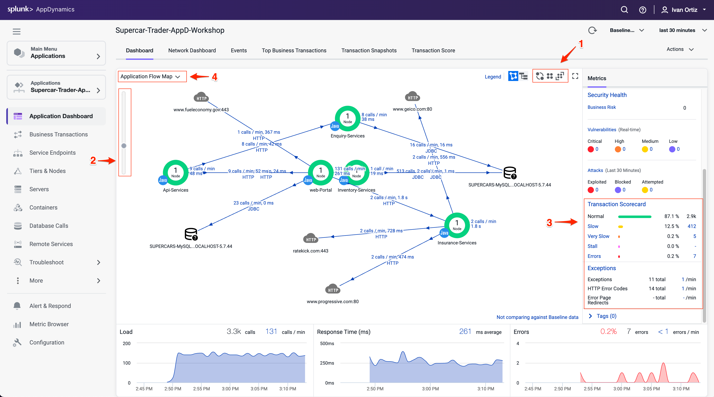
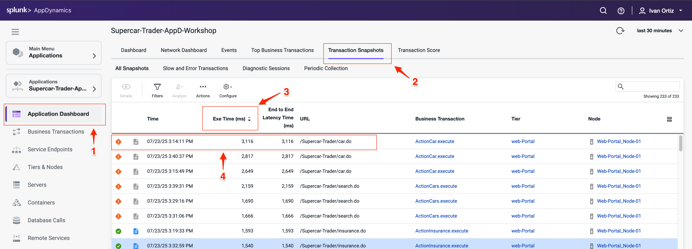
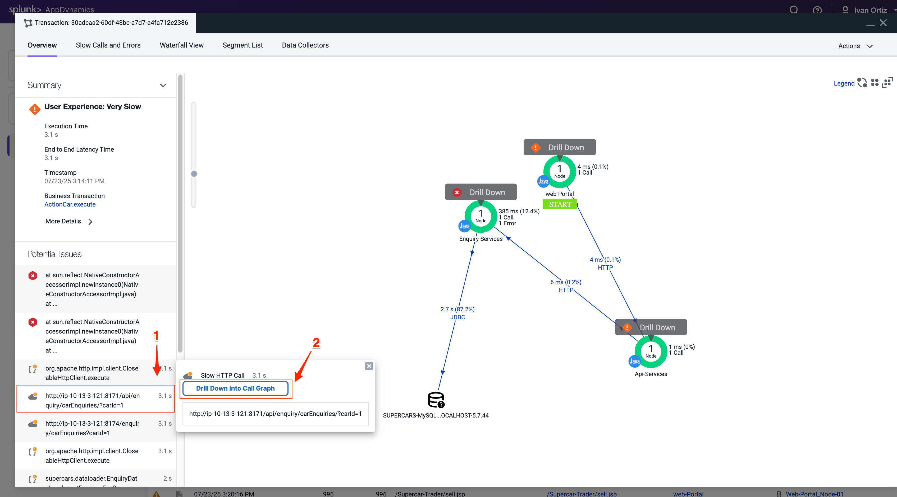
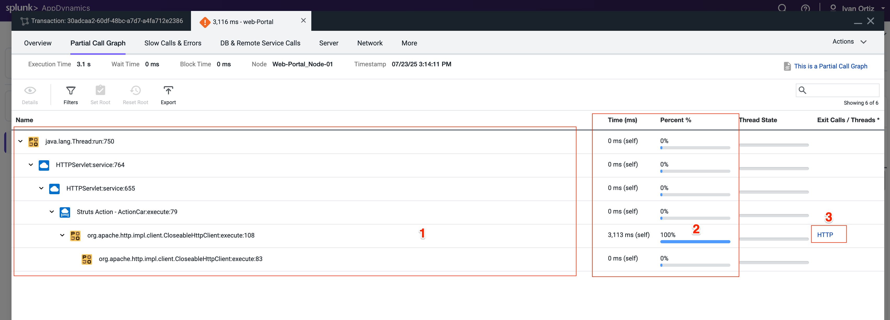

In this section you will learn about the core concepts of Splunk Appdynamics APM features. By the end of the section you will understand the following concepts:
- Application Flow Maps
- Business Transactions (BTs)
- Snapshots
- Call Graphs

## Flow Maps

AppDynamics app agents automatically discover the most common application frameworks and services. Using built-in application detection and configuration settings, agents collect application data and metrics to build Flow Maps.

AppDynamics automatically captures and scores every transaction. Flow Maps present a dynamic visual representation of the components and activities of your monitored application environment in direct context of the time frame that you have selected.

Familiarize yourself with the some of the different features of the Flow Map.

1. Try using the different layout options (you can also click and drag each icon on the Flow Map to reposition it).
2. Try using the slider and mouse scrollwheel to adjust the zoom level.
3. Look at the Transaction Scorecard.
4. Explore the options for editing the Flow Map.

You can read more about Flow Maps [here](https://help.splunk.com/en/appdynamics-saas/application-performance-monitoring/25.7.0/business-applications/flow-maps/flow-map-overview)  
  
  
  
## Business Transactions  
  
In the AppDynamics model, a Business Transaction represents the data processing flow for a request, most often a user request. In real-world terms, many different components in your application may interact to provide services to fulfill the following types of requests:

- In an e-commerce application, a user logging in, searching for items or adding items to the cart.
- In a content portal, a user requests content such as sports, business or entertainment news.
- In a stock trading application, operations such as receiving a stock quote, buying or selling stocks.  
  
Because AppDynamics orients performance monitoring around Business Transactions, you can focus on the performance of your application components from the user perspective. You can quickly identify whether a component is readily available or if it is having performance issues. For instance, you can check whether users are able to log in, check out or view their data. You can see response times for users, and the causes of problems when they occur.

You can read more about Business Transactions [here](https://help.splunk.com/en/appdynamics-saas/application-performance-monitoring/25.7.0/overview-of-application-monitoring/business-transactions) and [here](https://help.splunk.com/en/appdynamics-saas/application-performance-monitoring/25.7.0/business-transactions)  

## Verifying Business Transactions 

Verify that Business Transactions are being automatically detected by following these steps.

1. Click the **Business Transactions** option on the left menu.
2. Look at the list of Business Transactions and their performance.

  
  
  
## Snapshots

AppDynamics monitors every execution of a Business Transaction in the instrumented environment, and the metrics reflect all such executions. However, for troubleshooting purposes, AppDynamics takes snapshots (containing deep diagnostic information) of specific instances of transactions that are having problems.

Verify that transaction snapshots are being automatically collected by following these steps.

1. Click the **Application Dashboard** option on the left menu.
2. Click the **Transaction Snapshots** tab.
3. Click the **Exe Time (ms)** column to sort the snapshots with the greatest execution time.
4. Double-click a Business Transaction snapshot to display the snapshot viewer  
  
  

A transaction snapshot gives you a cross-tier view of the processing flow for a single invocation of a transaction.

The **Potential Issues** panel highlights slow methods and slow remote service calls and help you investigate the root cause for performance issues.  

## Drill Downs & Call Graphs

Call graphs and drill downs provide key information, including slowest methods, errors, and remote service calls for the transaction execution on a tier. A drill down may include a partial or complete call graph. Call graphs reflect the code-level view of the processing of the Business Transaction on a particular tier.
  
In the Flow Map for a Business Transaction snapshot, a tier with a Drill Down link indicates AppDynamics has taken a call graph for that tier.
  
Drill down into a call graph of the transaction snapshot by following these steps.
  
1. Click on a slow call in the Potential Issues list on the left.
2. Click Drill Down into Call Graph.

  
  
The call graph view shows you the following details.

1. The method execution sequence shows the names of the classes and methods that participated in processing the Business Transaction on this node, in the order in which the flow of control proceeded.
2. For each method, you can see the time and percentage spent processing and the line number in the source code, enabling you to pinpoint the location in the code that could be affecting the performance of the transaction.
3. The call graph displays exit call links for methods that make outbound calls to other components such as database queries and web service calls.

You can read more about Transaction Snapshots [here](https://help.splunk.com/en/appdynamics-saas/application-performance-monitoring/25.7.0/business-transactions/troubleshoot-business-transaction-performance-with-transaction-snapshots)

You can read more about Call Graphs [here](https://help.splunk.com/en/appdynamics-saas/application-performance-monitoring/25.7.0/business-transactions/troubleshoot-business-transaction-performance-with-transaction-snapshots/call-graphs)  
  
  

