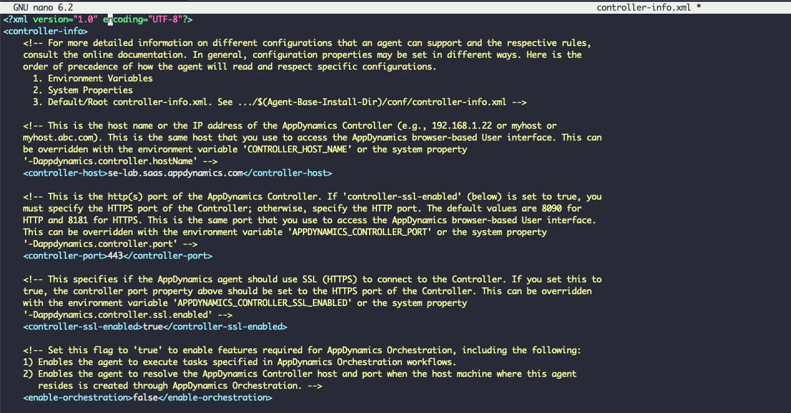

In this exercise you will perform the following actions:

1. Run a script that will install the Machine agent
2. Configure the Machine agent
3. Start the Machine agent


{}
We will use a script to download the machine agent into your EC2 instance. Normally, you would have to download the machine agent by logging into [https://accounts.appdynamics.com/](https://accounts.appdynamics.com/) but due to potential access limitations we will use the script which downloads it directly from the portal. If you have access to the AppDynamics portal and would like to download the machine agent, you can follow the below steps to download it and reference the steps used in the Install Agent section of the APM lab to SCP it into your VM.

1. Log into the [AppDynamics Portal](https://accounts.appdynamics.com/)
2. On the left side menu click on **Downloads**
3. Under **Type** select **Machine Agent**
4. Under **Operating System** Select **Linux**
5. Find the **Machine Agent Bundle - 64-bit linux (zip)** and click on the **Download** button. 
6. Follow the steps in the Install Agent section to SCP the downloaded file into your EC2 instance.
7. Unbundle the zip file into the /opt/appdynamics/machineagent directory and proceed to the configuration section of this lab
{}


## Run the Install Script

Use the command below to change to the directrory where the script is located. The script will downlaod and unbundle the machine agent

```bash
cd /opt/appdynamics/lab-artifacts/machineagent/
```

Use the command below to run the install script.

```bash
chmod +x install_machineagent.sh
./install_machineagent.sh
```

You should see output similar to the following image.


## Configure the Server Agent

Obtain the configuration property values listed below from the Java Agents “controller-info.xml” and have them available for the next step. 

```bash
cat /opt/appdynamics/javaagent/conf/controller-info.xml
```

- controller-host
- controller-port
- controller-ssl-enabled
- account-name
- account-access-key

Edit the “controller-info.xml” file of the machine Agent and insert the values for the properties you obtained from the Java Agent configuration file, listed below.

- controller-host
- controller-port
- controller-ssl-enabled
- account-name
- account-access-key

You will need to set the “sim-enabled” property to true and then save the file which should look similar to the image below.

```bash
cd /opt/appdynamics/machineagent/conf
nano controller-info.xml
```



## Start the Server Visibility agent

Use the following commands to start the Server Visibility agent and verify that it started.

```bash
cd /opt/appdynamics/machineagent/bin
nohup ./machine-agent &
ps -ef | grep machine
```

You should see output similar to the following image.


