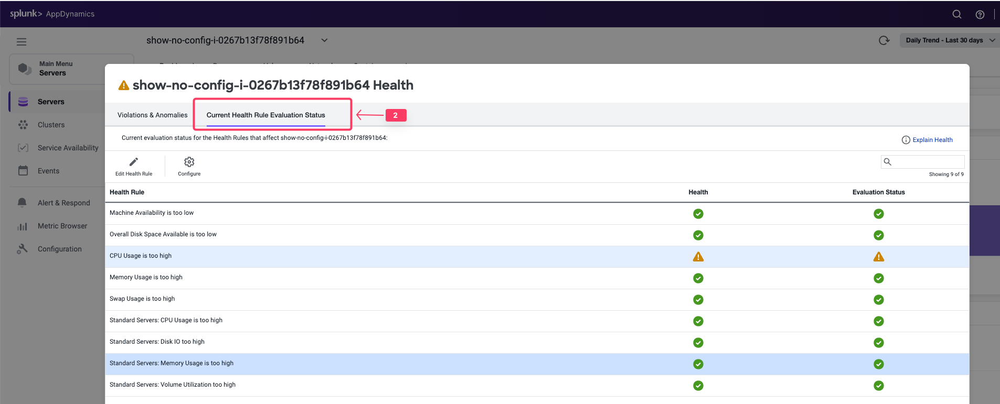
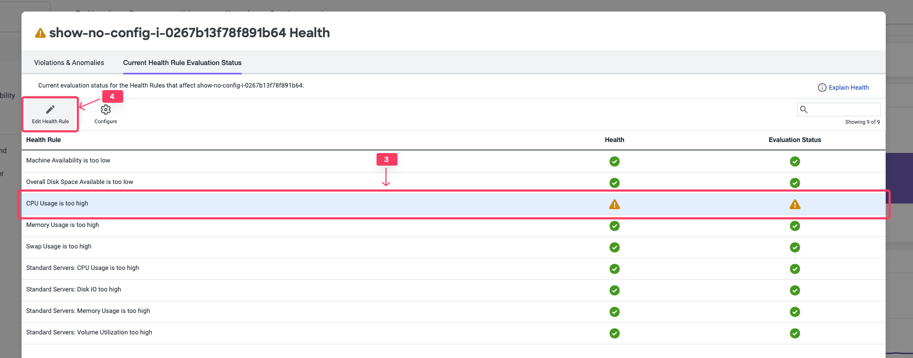
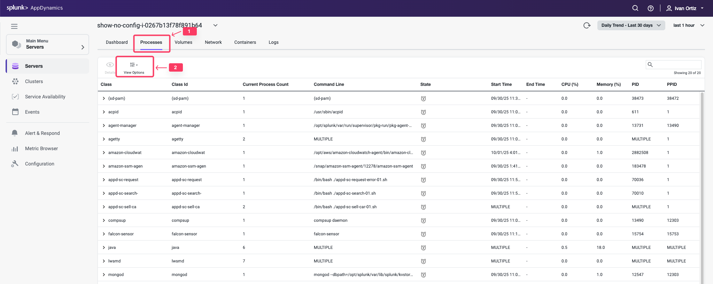
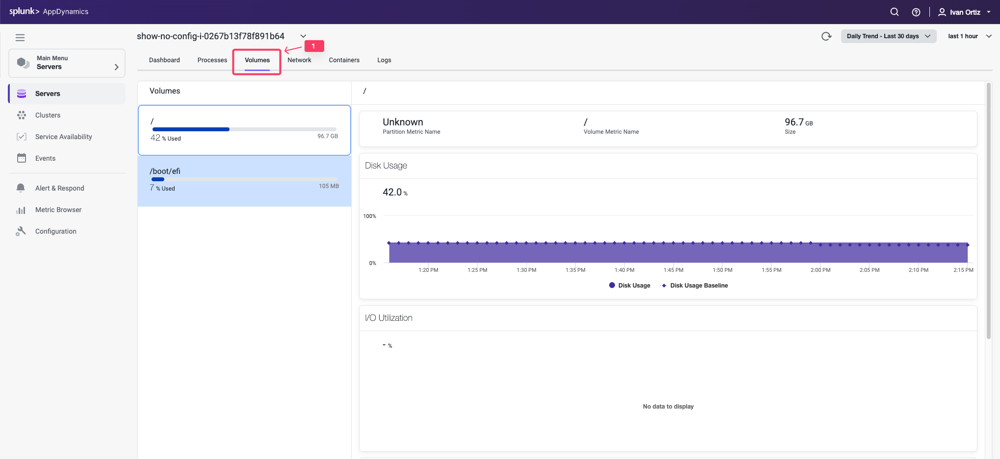
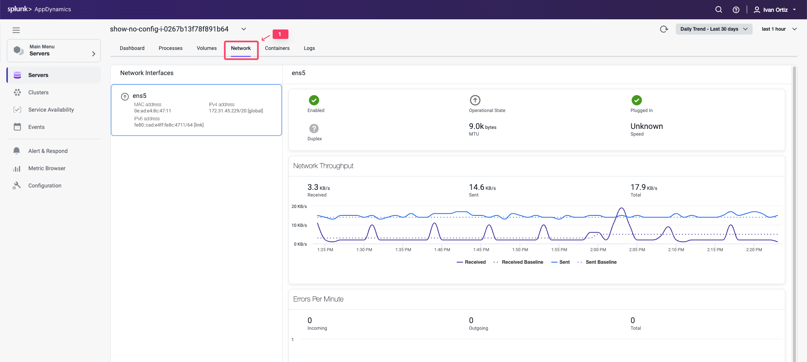

In this exercise you will complete the following tasks:

- Review the Server Main dashboard
- Review the Server Processes dashboard
- Review the Server Volumes dashboard
- Review the Server Network dashboard
- Navigate between Server and Application contexts

## Review the Server Main Dashboard

Now that you have the Machine agent installed, let’s take a look at some of the features available in the Server Visibility module. From your **Application Dashboard**, click on the **Servers** tab and drill into the servers main dashboard by following these steps.

1. Click the **Servers** tab on the left menu.
2. Check the **checkbox** on the left for your server.
3. Click **View Details**.

You can now explore the server dashboard. This dashboard enables you to perform the following tasks:

See charts of key performance metrics for the selected monitored servers, including:  
-  Server availability
- CPU, memory, and network usage percentages
- Server properties
- Disk, partition, and volume metrics
- Top 10 processes consuming CPU resources and memory.

You can read more about the Server Main dashboard [here](https://help.splunk.com/en/appdynamics-saas/infrastructure-visibility/25.7.0/server-visibility/monitor-your-servers-using-server-visibility/server-dashboard).

Review the **Top Pane** of the dashboard which provides you the following information:
- Host Id: This is an ID for the server that is unique to the Splunk AppDynamics Controller
- Health: Shows the overall health of the server. 
- Hierachy: Arbitrary hierarchy to group your severs together. See documentation for additional details [here](https://help.splunk.com/en/appdynamics-saas/infrastructure-visibility/25.7.0/machine-agent/configure-the-machine-agent/machine-agent-configuration-properties)

1. Click on the health server icon to view the **Violations * Anomalies** panel. Review the panel to identify potential issues
2. Click on the **Current Health Rule Evaluation Status** to see if there are any current issues being alerted on for this server 

3. Click on the **CPU Usage too high** rule 
4. Click on **Edit Health Rule**. This will open the **Edit Health Rule** panel

This panel gives us the ability to configure the Health Rule. A different lab will go into more details on creating and customizing health rules. For now we will just review the existing rule

5. Click on the **Warning Criteria** 

In this example we can see that the warning criteria is set when the CPU is above 5%. This is the reason why our health rule is showing a warning and not a healthy state. Cancel out of the **Edit Health Rule** panel to get back to the **Server Dashboard**

## Review the Server Processes Dashboard

1. Click the **Processes** tab.
2. Click **View Options** to select different data columns. Review the KPIs available to view 

You can now explore the server processes dashboard. This dashboard enables you to perform the following tasks:
- View all the processes active during the selected time period. The processes are grouped by class as specified in the ServerMonitoring.yml file.
- View the full command line that started this process by hovering over the process entry in the Command Line column.
- Expand a process class to see the processes associated with that class.
- Use View Options to configure which columns to display in the chart.
- Change the time period of the metrics displayed.
- Sort the chart using the columns as a sorting key. You can not sort on sparkline charts: CPU Trend and Memory Trend.
- See CPU and Memory usage trends at a glance.

You can read more about the Server Processes dashboard [here](https://help.splunk.com/en/appdynamics-saas/infrastructure-visibility/25.7.0/server-visibility/monitor-your-servers-using-server-visibility/server-process-metrics).

## Review the Server Volumes Dashboard

1. Click the **Volumes** tab.

You can now explore the server volumes dashboard. This dashboard enables you to perform the following tasks:

- See the list of volumes, the percentage used and total storage space available on the disk, partition or volume.
- See disk usage and I/O utilization, rate, operations per second, and wait time.
- Change the time period of the metrics collected and displayed.
- Click on any point on a chart to see the metric value for that time.

You can read more about the Server Volumes dashboard [here](https://help.splunk.com/en/appdynamics-saas/infrastructure-visibility/25.7.0/server-visibility/monitor-your-servers-using-server-visibility/server-volumes-metrics).

## Review the Server Network Dashboard

1. Click the Network tab.

You can now explore the **Server Network** dashboard. This dashboard enables you to perform the following tasks:

- See the MAC, IPv4, and IPv6 address for each network interface.
- See whether or not the network interface is enabled, functional, its operational state equipped with an ethernet cable that is plugged in, operating in full or half-full duplex mode, maximum transmission unit (MTU) or size (in bytes) of the largest protocol data unit that the network interface can pass, speed of the ethernet connection in Mbit/sec.
- View network throughput in kilobytes/sec and packet traffic.
- Change the time period of the metrics displayed.
- Hover over on any point on a chart to see the metric value for that time.

You can read more about the Server Network dashboard [here](https://help.splunk.com/en/appdynamics-saas/infrastructure-visibility/25.7.0/server-visibility/monitor-your-servers-using-server-visibility/server-network-metrics).

