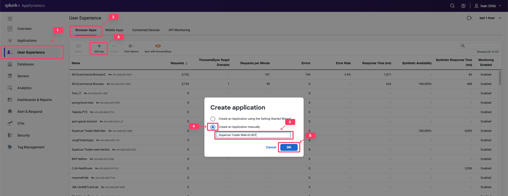
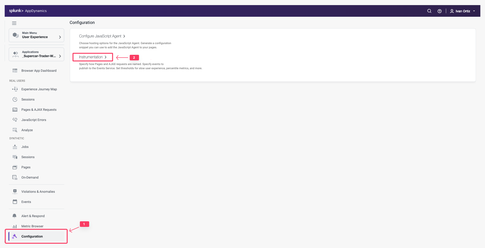
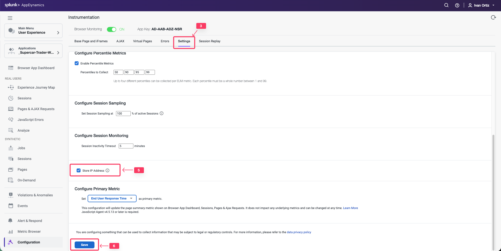

In this exercise you will complete the following tasks:

*   Access your AppDynamics Controller from your web browser.
*   Create the Browser Application in the Controller.
*   Configure the Browser Application.

## Login to the Controller
Log into the [AppDynamics SE Lab Controller](https://se-lab.saas.appdynamics.com/controller/) using your Cisco credentials.

## Create the Browser Application in the Controller

Use the following steps to create your new browser application.

{}
It is **very important** that you create a unique name for your browser application in Step 5 below.
{}

1. Click the **User Experience** tab on the top menu.
2. Click the **Browser Apps** option under **User Experience**.
3. Click **Add App**.
4. Choose the option **Create an Application manually**.
5. Type in a unique name for your browser application in the format _Supercar-Trader-Web-<your\_initials\_or\_name>-<four\_random\_numbers>_ 
    * Example 1: Supercar-Trader-Web-JFK-3179
    * Example 2: Supercar-Trader-Web-JohnSmith-0953   
6. Click **OK**.

You should now see the **Browser App Dashboard** for the **Supercar-Trader-Web-##-####** application.

1. Click the **Configuration** tab on the left menu.
2. Click the **Instrumentation** option.

Change the default configuration to have the IP Address stored along with the data captured by the browser monitoring agent by following these steps.

3. Click the **Settings** tab.
4. Use the scroll bar on the right to scroll to the bottom of the screen.
5. Check the **Store IP Address** check box.
6. Click **Save**.

You can read more about configuring the Controller UI for Browser RUM [here](https://help.splunk.com/en/appdynamics-saas/end-user-monitoring/25.7.0/end-user-monitoring/browser-monitoring/browser-real-user-monitoring/overview-of-the-controller-ui-for-browser-rum/configure-the-controller-ui-for-browser-rum).

