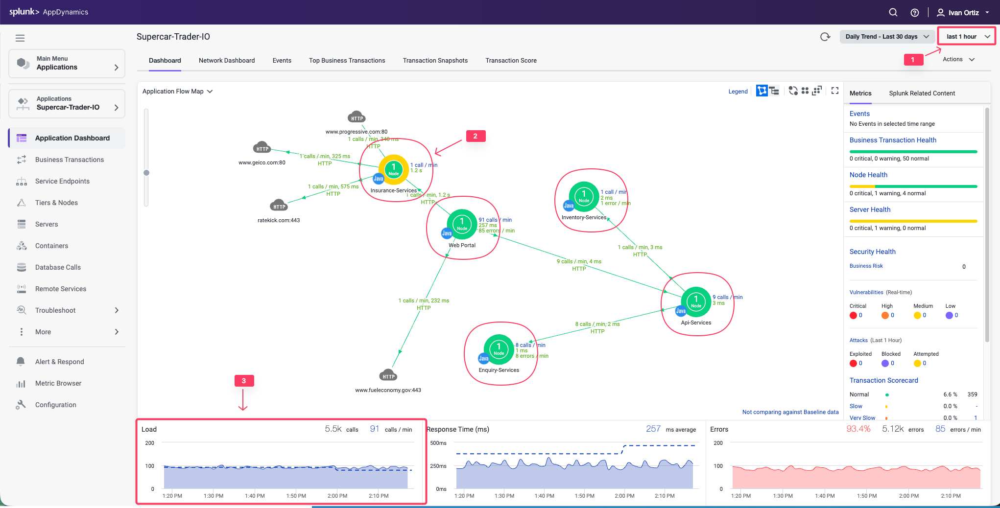
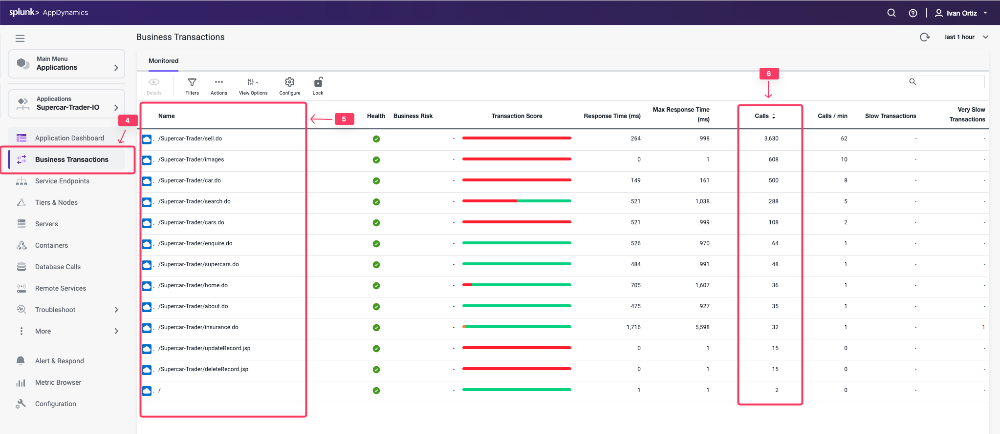
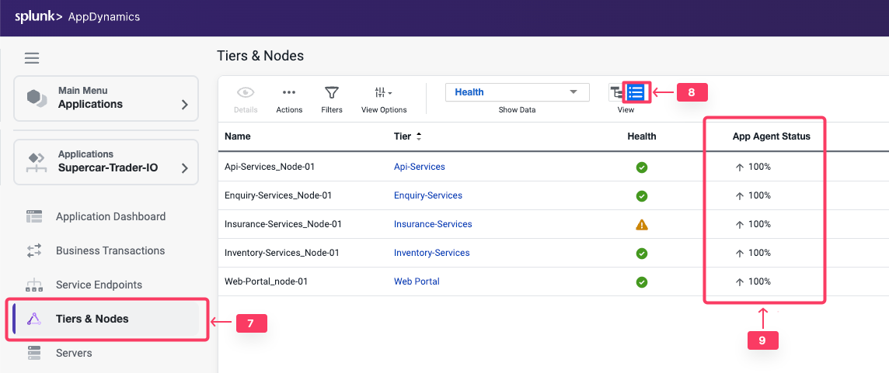
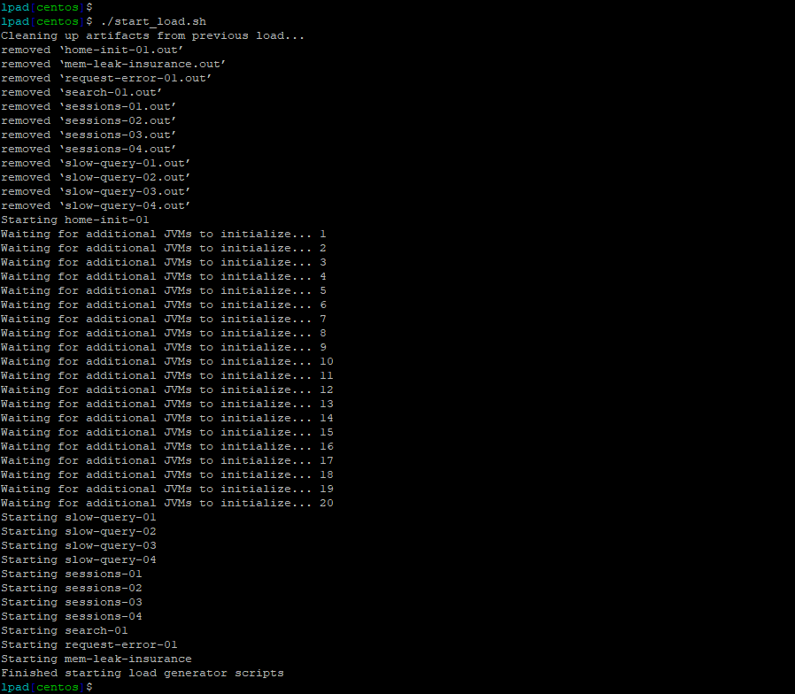

In this exercise you will complete the following tasks:

*   Access your AppDynamics Controller from your web browser.
*   Verify transaction load to the application.
*   Restart the application and transaction load if needed.

## Login to the Controller
Log into the [AppDynamics SE Lab Controller](https://se-lab.saas.appdynamics.com/controller/) using your Cisco credentials.

## Verify transaction load to the application

Check the application flow map:

1. Select the **last 1 hour** time frame.
2. Verify you see the five different Tiers on the flow map.
3. Verify there has been consistent load over the last 1 hour.



Check the list of business transactions:

4. Click the **Business Transactions** option on the left menu.
5. Verify you see the eleven business transactions seen below.
6. Verify that they have some number of calls during the last hour.

**Note:** If you don’t see the **Calls** column, you can click the **View Options** toolbar button to show that column.



Check the agent status for the Nodes:

7. Click the **Tiers & Nodes** option on the left menu.
8. Click **Grid View**.
9. Verify that the **App Agent Status** for each Node is greater than 90% during the last hour.




## Restart the Application and Load Generation if Needed

If any of the checks you performed in the previous steps could not be verified, SSH into your **Application VM** and follow these steps to restart the application and transaction load.

Use the following commands to stop the running instance of Apache Tomcat.

{}

``` bash
cd /usr/local/apache/apache-tomcat-9/bin
./shutdown.sh
```

{}


Use the command below to check for remaining application JVMs still running.


{}

``` bash
ps -ef | grep Supercar-Trader
```

{}


If you find any remaining application JVMs still running, kill the remaining JVMs using the command below.


{}

``` bash
sudo pkill -f Supercar-Trader
```

{}


Use the following commands to stop the load generation for the application. Wait until all processes are stopped. 

``` bash
cd /opt/appdynamics/lab-artifacts/phantomjs
./stop_load.sh
```

Restart the Tomcat server:
``` bash
cd /usr/local/apache/apache-tomcat-9/bin
./startup.sh
```

Wait for two minutes and use the following command to ensure Apache Tomcat is running on port 8080.


{}
``` bash
curl localhost:8080
```
{}
{}
``` bash
<!DOCTYPE html>
<html lang="en">
    <head>
        <meta charset="UTF-8" />
        <title>Apache Tomcat/9.0.50</title>
        <link href="favicon.ico" rel="icon" type="image/x-icon" />
        <link href="tomcat.css" rel="stylesheet" type="text/css" />
    </head>

    <body>
        <div id="wrapper"
....
```
{}


Use the following commands to start the load generation for the application.

``` bash
cd /opt/appdynamics/lab-artifacts/phantomjs
./start_load.sh
```

You should see output similar to the following image.


