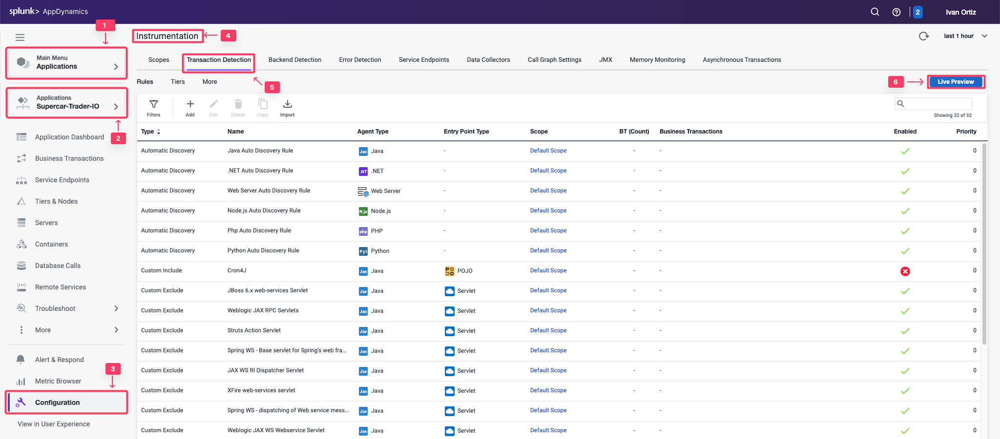
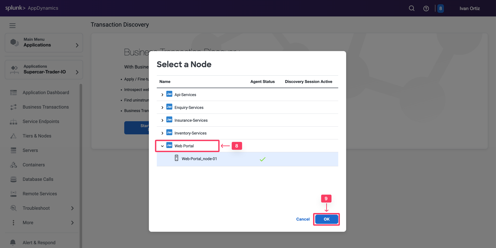
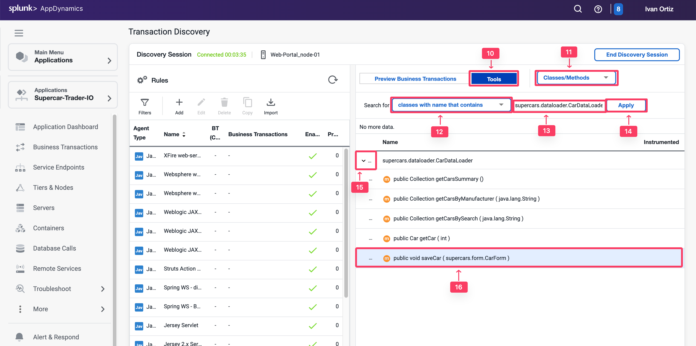
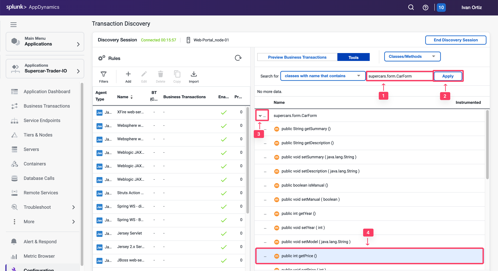
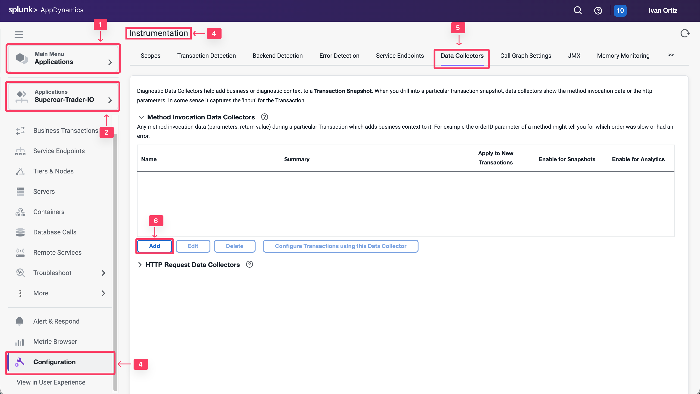
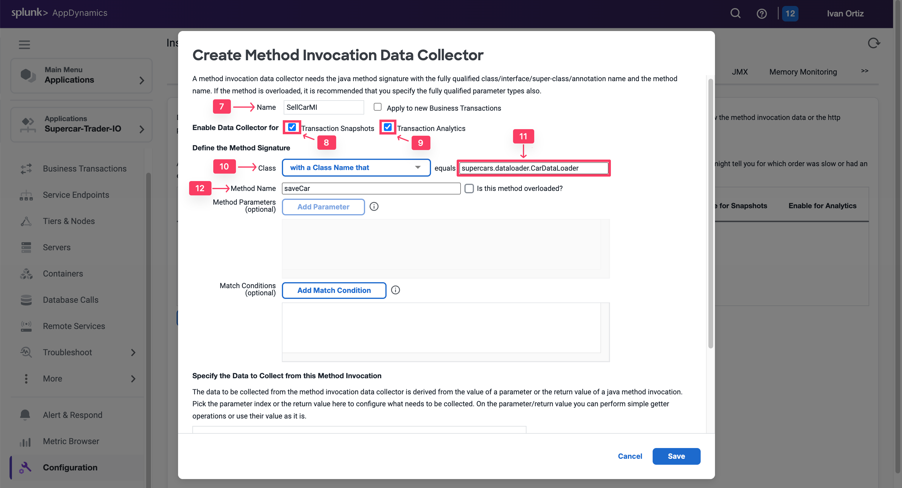
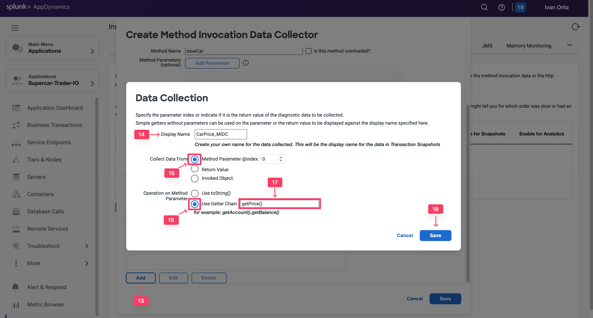
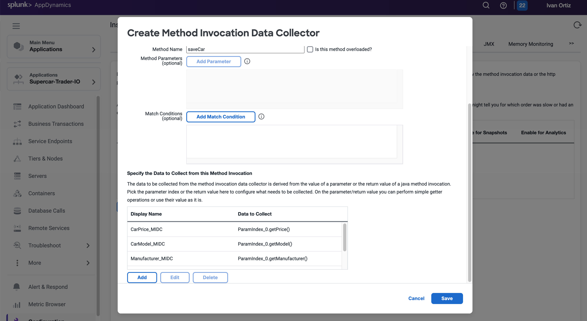
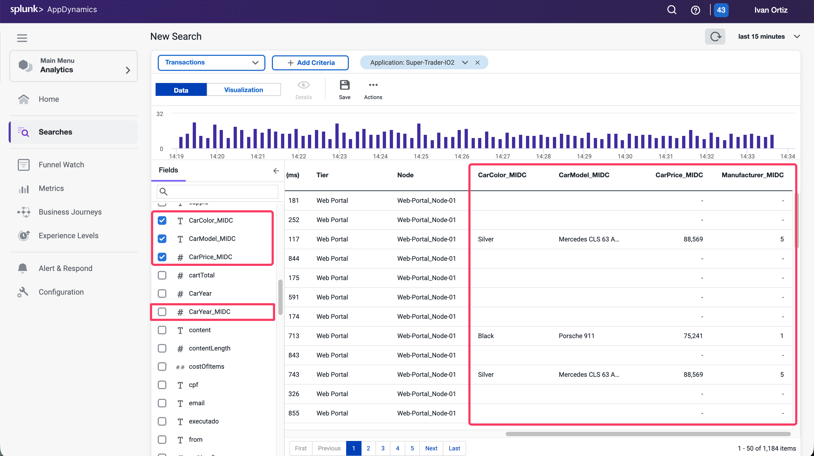

Method invocation data collectors capture code data such as method arguments, variables, and return values. If HTTP data collectors don’t have sufficient business data, you can still capture these information from the code execution.

In this exercise you will perform the following tasks:

*   Discover methods.
*   Open a discovery session.
*   Discover method parameters.
*   Drill down to an object within the code.
*   Create a method invocation data collector.
*   Validate analytics on method invocation data collectors.


## Open a Discovery Session

You may not have an application developer available to identify the method or parameters from the source code. However, there is an approach to discover the application methods and objects directly from AppDynamics.

1. Select the **Applications** tab at the top left of the screen.
2. Select **Supercar-Trader-YOURINITIALS** application
3. Select the **Configuration** tab.
4. Click on the **Instrumentation** link.
5. Select the **Transaction Detection** tab.
6. Click on the **Live Preview Button** on the tight.




7. Click on **Start Discovery Session** button
8. Select the **Web-Portal Node** in the pop-up windows. It should be the same node that the method you are investigating runs on
9. Click **Ok**



10. Select **Tools** on the right toggle.
11. Select **Classes/Methods** in the drop-down list.
12. Select **Classes** with name in the **Search** section.
13. Type in the class name **supercars.dataloader.CarDataLoader** in the text box. To find the class name you can search through call graphs, or ideally find it in the source code. 
14. Click **Apply** to search for the matching class methods.
15. Once the results appear, expand the class that matches your search.
16. Look for the same method **saveCar**.



Note that the **saveCar** method takes a **CarForm** object as an input parameter.

## Drill Down to the Object

Now you have found the method, explore its parameters to find out where you can pull the car details properties.

You saw that **saveCar** method takes the complex object **CarForm** as an input parameter. This object will hold the form data that was entered on the application webpage. Next, you need to inspect that object and find out how you can pull the car details from it.

1. Type in the class name of the input object **supercars.form.CarForm** in the text box
2. Click **Apply** to search for the class methods.
3. When the results appear, expand the **supercars.form.CarForm** class that matches the search.
4. Look for the methods that will return the car details that you want. You will find **get** methods for price, model, color, and more.



## Create Method Invocation Data Collector

With the findings from the previous exercises, you can now configure a method invocation data collector to pull the car details directly from the running code in runtime.

1. Select the **Applications** tab.
2. Select **Supercar-Trader-YOURINITIALS** Application
3. Select the **Configuration** tab.
4. Click on the **Instrumentation** link.
5. Select the **Data Collectors** tab.
6. Click **Add** in the **Method Invocation Data Collectors**.



We will create a method invocation data collector to capture the car details.

7. For the **Name**, specify **SellCarMI-YOURINITIALS**.
8. Enable **Transaction Snapshots**.
9. Enable **Transaction Analytics**.
10. Select **with a Class Name that**.
11. Add **supercars.dataloader.CarDataLoader** as the **Class Name**.
12. Add **saveCar** as the **Method Name**.



Then as observed, the Input Parameter of Index 0 in SaveCar method was an on Object of Class **CarForm**, and then there is a Getter method inside that object that returns the car details properties such as **getPrice()**.

So to explain that how we fetched that value in the MIDC, we will do the below:

13. Click on **Add**  at the bottom of the MIDC panel, to specify the new data that you want to collect.
14. In the Display Name, specify **CarPrice_MIDC**
15. In the Collect Data From, select **Method Parameter of Index 0**, which is our **CarForm Object**.
16. For the **Operation on Method Parameter**, select **Use Getter Chain**. You will be calling a method inside CarForm to return the car details.
17. Then specify **getPrice()**, the Getter method inside the **CarForm** class that will return the price.
18. Click **Save**.



19. Repeat the above steps for all the properties, including color, model, and any others that you want to collect data for.



20. **Save MIDC**, and apply to the **”/Supercar-Trader/sell.do”** business transaction.

The implementation of the MIDC requires that we restart the JVM:

1. SSH into your EC2 instance
2. Shutdown the Tomcat Sever

``` bash
cd /usr/local/apache/apache-tomcat-9/bin
./shutdown.sh
```
If you find any remaining application JVMs still running, kill the remaining JVMs using the command below.


{}

``` bash
sudo pkill -f Supercar-Trader
```

{}


3. Restart the Tomcat Server

``` bash
./startup.sh
```
4. Validate that the Tomcat server is running, this can take a few minutes


{}
``` bash
curl localhost:8080
```
{}
{}
``` bash
<!DOCTYPE html>
<html lang="en">
    <head>
        <meta charset="UTF-8" />
        <title>Apache Tomcat/9.0.50</title>
        <link href="favicon.ico" rel="icon" type="image/x-icon" />
        <link href="tomcat.css" rel="stylesheet" type="text/css" />
    </head>

    <body>
        <div id="wrapper"
....
```
{}



## Validate analytics on MD parameters

Go to the website and apply some manual load on the Sell Car Page by submitting the form a couple of times.

You will now verify if the business data was captured by HTTP data collectors in AppDynamics Analytics.

1. Select the **Analytics** tab. 
2. Select the **Searches** tab and Add a new **Drag and Drop Search**. 
3. Click the **+ Add** button and create a new **Drag and Drop Search**.
4. Click **+ Add Criteria** 
5. Select **Application** and Search For Your Application Name **Supercar-Trader-YOURINITIALS**
6. Verify that the **Business Parameters** appear as a field in the **Custom Method Data**. 
7. Verify that the **CarPrice Field** has data.



## Conclusion

You have now captured the business data from the Sell Car transaction from the node at runtime. This data can be used in the Analytical and Dashboard features within AppDynamics to provide more context to the business and measure IT impact on the business.