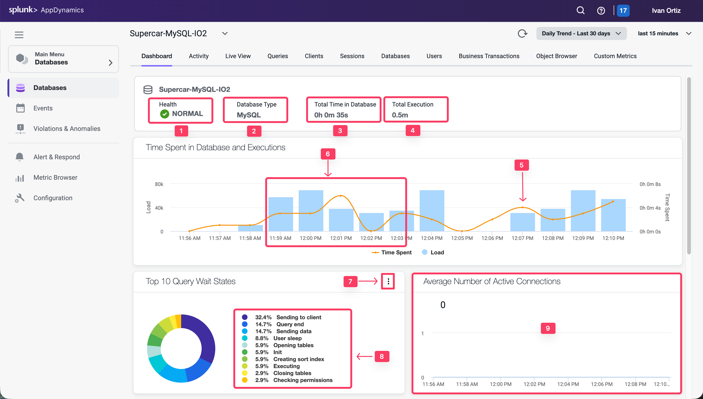
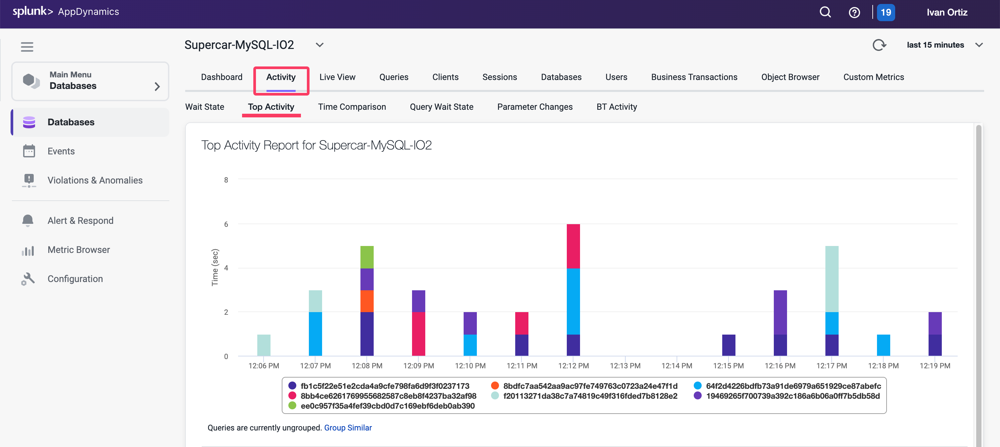

## Monitor and Troubleshoot - Part 1

In this exercise you will perform the following tasks:

- Review the Overall Database and Server Performance Dashboard
- Review the Main Database Dashboard
- Review the Reports in the Database Activity Window

## Review the Overall Database and Server Performance Dashboard

The Overall Database and Server Performance Dashboard allows you to quickly see the health of each database at a glance.

1. Filters: Enables you to explore the options to filter by health, load, time in database or type.
2. Actions: Exports the data on this window in a .csv formatted file.
3. View Options: Toggles the spark charts on and off.
4. View: Switches between the card and list view.
5. Sort: Displays the sorting options.
6. Supercar-MySQL: Drills into the main database dashboard.

## Review the Main Database Dashboard

The main database dashboard shows you key insights for the database including:

- The health of the server that is running the database.
- The total number of calls during the specified time period.
- The number of calls for any point in time.
- The total time spent executing SQL statements during the specified time period.
- The top ten query wait states.
- The average number of connections.
- The database type or vendor.
- Explore the features of the dashboard.

1. Click the health status circle to see details of the server health:

* Green: server is healthy.
* Yellow: server with warning-level violations.
* Red: server with critical-level violations.

2. The database type or vendor will always be seen here.
3. Observe the total time spent executing SQL statements during the specified time period.
4. Observe the total number of executions during the specified time period.
5. Hover over the time series on the chart to see the detail of the recorded metrics.

Click the orange circle at the top of the data point to view the time comparison report, which shows query run times and wait states 15 minutes before and 15 minutes after the selected time.

6. Left-click and hold down your mouse button while dragging from left to right to highlight a spike seen in the chart.
7. Click the configuration button to exclude unwanted wait states from the top ten.
8. Hover over the labels for each wait state to see a more detailed description.
9. Observe the average number of active connections actively running a query during the selected time period.

To view the OS metrics of the DB server for the time period that you have selected:

1. Scroll to the bottom of the dashboard using the scroll bar on the right
2. CPU
3. Memory
4. Disk IO
5. Network IO

## Review the Reports in the Database Activity Window

There are up to nine different reports available in Database Visibility on the Database Activity Window. The reports available depend on the database platform being monitored. In this exercise we will review three of the most common reports.

- Wait State Report
- Top Activity Report
- Query Wait State Report

## Wait State Report

This report displays time-series data on Wait Events (states) within the database. Each distinct wait is color-coded, and the Y-axis displays time in seconds. This report also displays data in a table and highlights the time spent in each wait state for each SQL statement.

The wait states consuming the most time may point to performance bottlenecks. For example, db file sequential reads may be caused by segment header contention on indexes or by disk contention.

## Top Activity Report

This report displays the top time in database SQL statements in a time-series view. This report also displays data in a table and highlights the time spent in the database for each of 10 top SQL statements.

Use this report to see which SQL statements are using the most database time. This helps to determine the impact of specific SQL statements on overall system performance allowing you to focus your tuning efforts on the statements that have the most impact on database performance.

## Query Wait State Report

This report displays the wait times for the top (10, 50, 100, 200) queries. This report also displays data in a table and highlights the time each query is spending in different wait states. Use the columns to sort the queries by the different wait states.

You can read more about the Reports in the Database Activity Window [here](https://help.splunk.com/en/appdynamics-on-premises/database-visibility/25.4.0/monitor-databases-and-database-servers/monitor-database-performance/database-activity-window/features-of-the-database-activity-windows)

