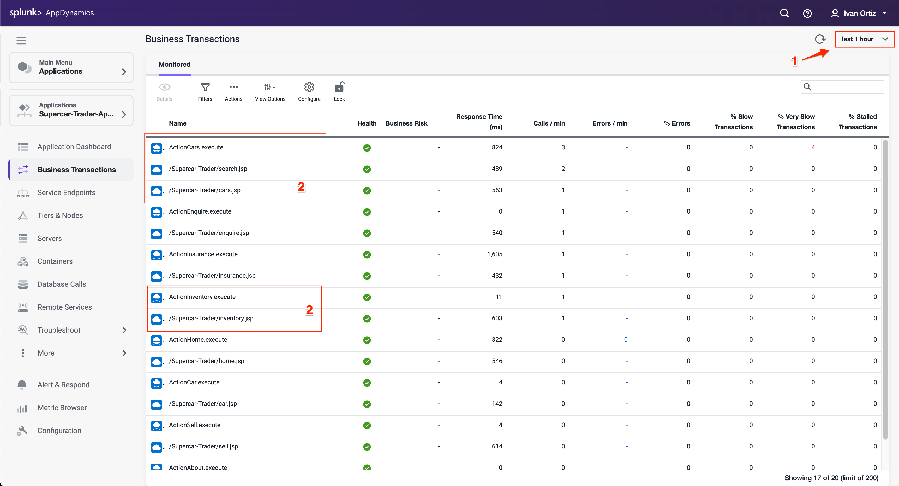
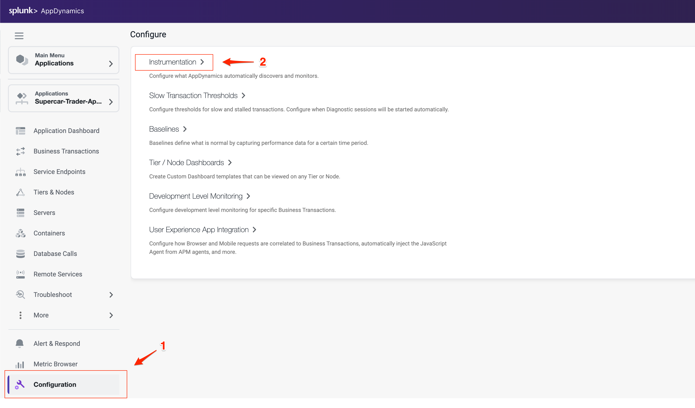
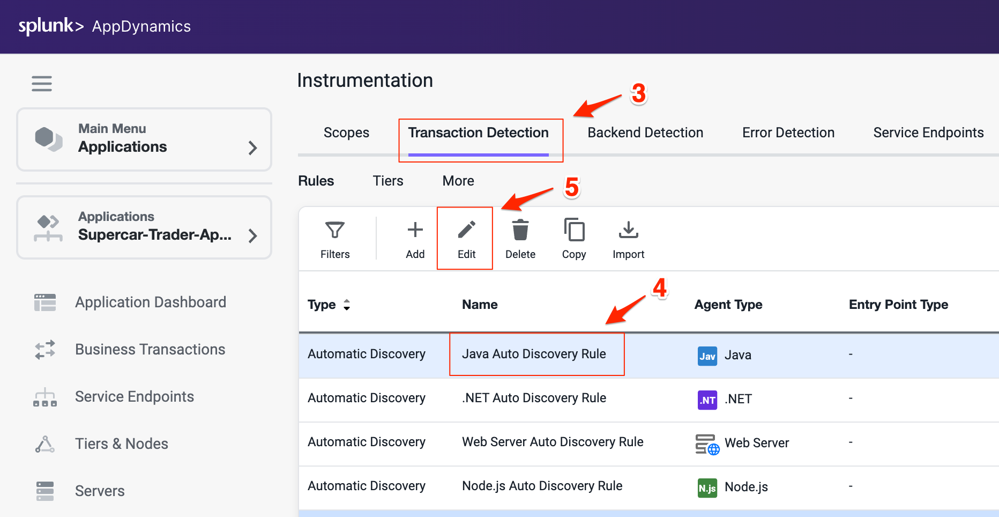
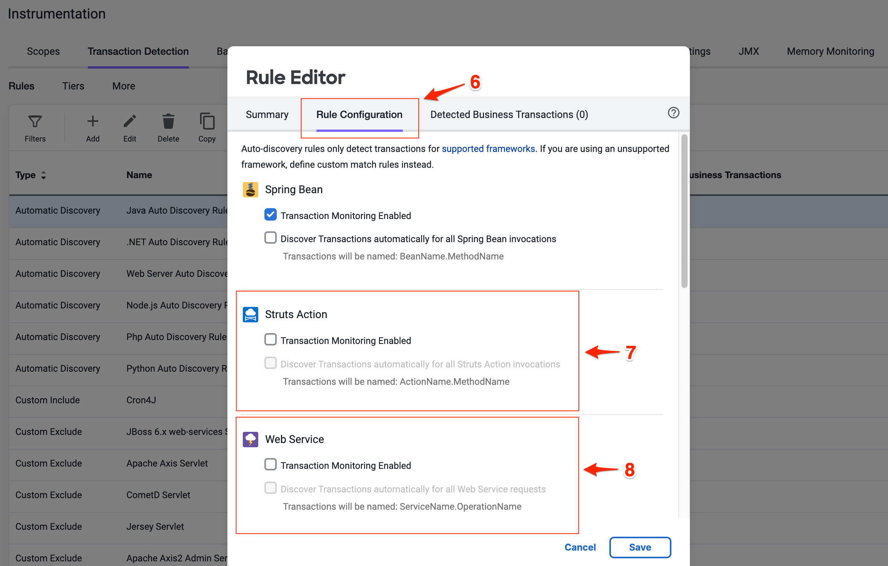
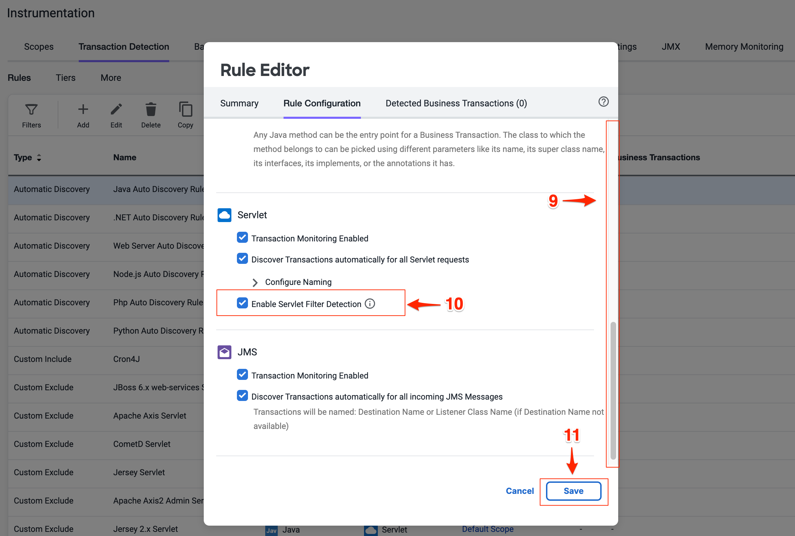
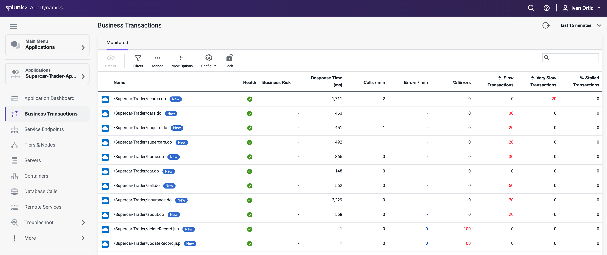

In this exercise you will complete the following tasks:

- Adjust Business Transaction settings.
- Adjust Call Graph settings.
- Observe Business Transaction changes.

## Adjust Business Transaction Settings  

In the last exercise, you validated that Business Transactions were being auto-detected. There are times when you want to adjust the Business Transaction auto-detection rules to get them to an optimal state. This is the case with our sample application, which is built on an older Apache Struts framework.  

The business transactions highlighted in the following image show that each pair has a Struts Action (.execute) and a Servlet type (.jsp). You will be adjusting the settings of the transaction detection rules so that these two types of transactions will be combined into one.  

Anytime you see the time frame selector visible in the AppDynamics UI, the view you see will represents the context of the time frame selected. You can choose one of the pre-defined time frames or create your own custom time frame with the specific date and time range you want to view.

1. Select the last 1 hour time frame.
2. Use your mouse to hover over the blue icons to see the Entry Point Type of the transaction.

Optimize the transaction detection by following these steps:  

1. Click the **Configuration** option toward the bottom left menu.
2. Click the **Instrumentation** link.

    

3. Select **Transaction Detection** from the Instrumentation menu.
4. Select the **Java Auto Discovery Rule**.
5. Click **Edit**.

      

6. Select the **Rule Configuration** tab on the Rule Editor.
7. Uncheck all the boxes on **Struts Action** section.
8. Uncheck all the boxes on **Web Service** section.
9. Scroll down to find the Servlet settings.
10. Check the box **Enable Servlet Filter Detection** (all three boxes should be checked on Servlet settings).
11. Click **Save** to save your changes.

You can read more about Transaction Detection Rules [here](https://help.splunk.com/en/appdynamics-saas/application-performance-monitoring/25.7.0/configure-instrumentation/transaction-detection-rules).

  
  

## Adjust Call Graph settings

You can control the data captured in call graphs within transaction snapshots with the Call Graph Settings window seen below. In this step you will change the SQL Capture settings so the parameters of each SQL query are captured along with the full query. You can change the SQL Capture settings by following these steps.

1. Select the **Call Graph Settings** tab from the Instrumentation window. This is within the **Instrumentation** settings which we navigated to from the previous exercise.
2. Ensure you have the **Java** tab selected within the settings.
3. Scroll down until you see the **SQL Capture Settings**.
4. Click the **Capture Raw SQL** option.
5. Click **Save**.

You can read more about Call Graph settings [here](https://help.splunk.com/en/appdynamics-saas/application-performance-monitoring/25.7.0/configure-instrumentation/call-graph-settings).  

  

## Observe Business Transaction changes

It may take up to 30 minutes for the new business transactions to replace the prior transactions. The list of business transactions should look like the following example after the new transactions are detected.

1. Click on **Business Transactions** on the left menu.
2. Adjust your time range picker to look at the **last 15 minutes**

