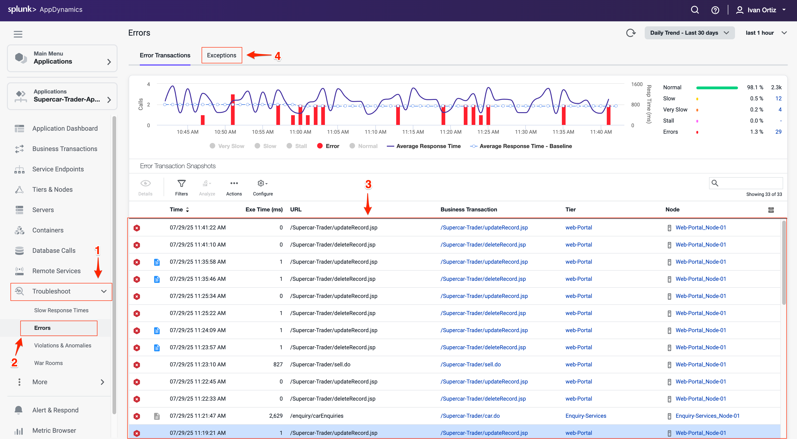
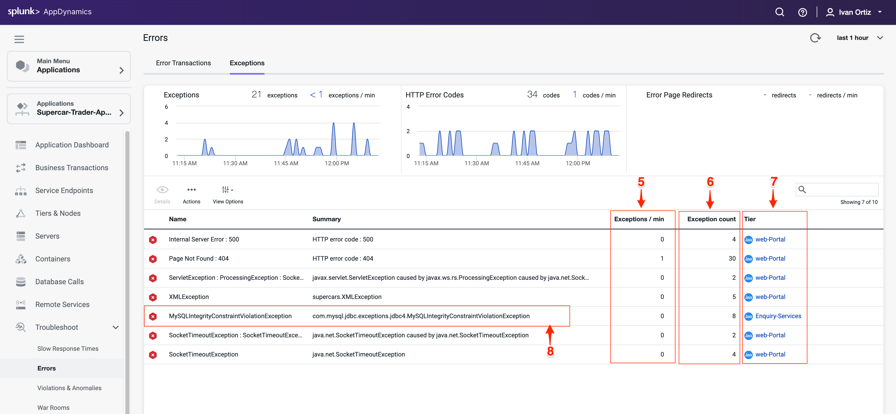
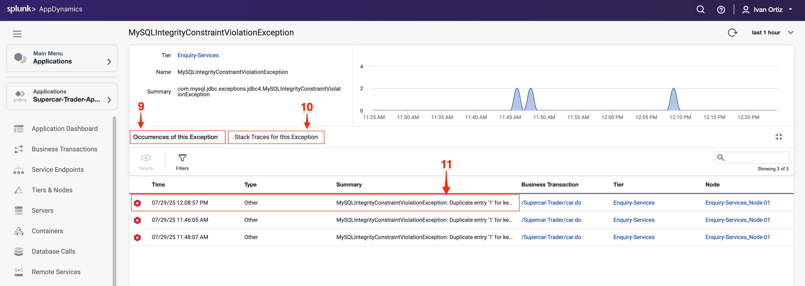
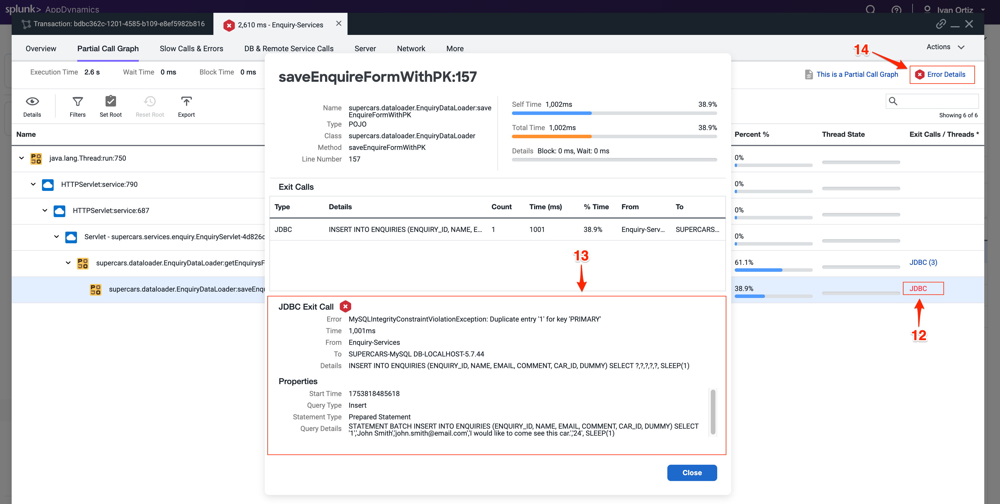
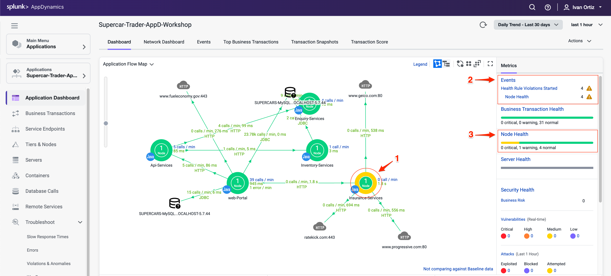
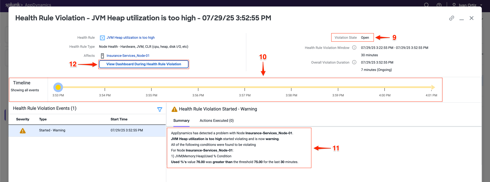
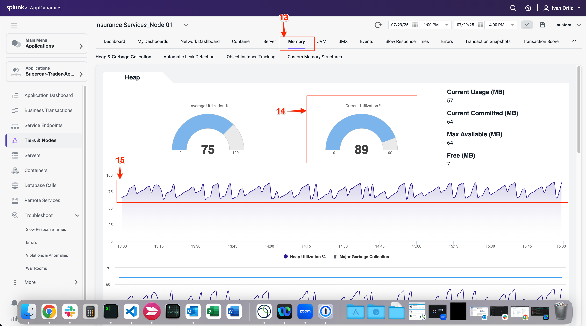
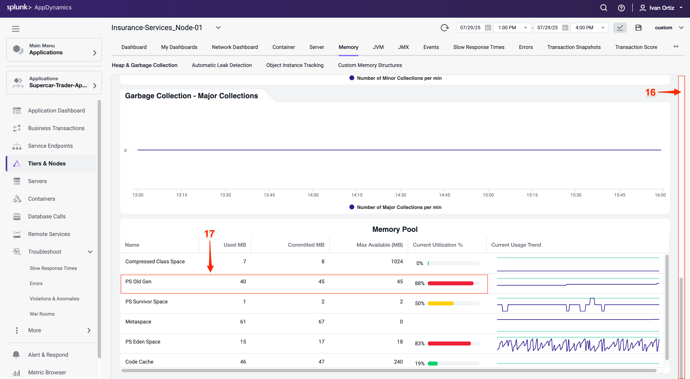

In this exercise, you will learn how to effectively detect and diagnose errors within your application to identify their root causes. Additionally, you will explore how to pinpoint specific nodes that may be underperforming or experiencing errors, and apply troubleshooting techniques to resolve these performance issues. This hands-on experience will enhance your ability to maintain application health and ensure optimal performance.  

## Find Specific Errors Within Your Application

AppDynamics makes it easy to find errors and exceptions within your application. You can use the **Errors** dashboard to see transactions snapshots with errors and find the exceptions that are occurring most often. Identifying errors quickly helps prioritize fixes that improve application stability and user experience. Understanding the types and frequency of exceptions allows you to focus on the most impactful issues.  

1. Click on the **Troubleshoot** option on the left menu.
2. Click on the **Errors** option on the left menu. This navigates you to the Errors dashboard where you can quickly identify business transactions with errors
3. Explore a few of the error transaction snapshots. Reviewing snapshots helps you see the exact context and flow when errors occurred.
4. Click on the **Exceptions** tab to see exceptions grouped by type. Grouping by exception type helps identify recurring problems and patterns.

    

    The **Exceptions** tab shows you what types of exceptions are occurring the most within the application so you can prioritize remediating the ones having the most impact.

5. Observe the **Exceptions per minute** and **Exception count** (6) to understand error frequency. High frequency exceptions often indicate critical issues needing immediate attention.
6. Note the **Tier** where exceptions occur to localize the problem within your application architecture. Knowing the affected tier helps narrow down the root cause.
7. Double-click on the MySQLIntegrityConstraintViolationException type to drill deeper.  

    
  
8. Review the overview dashboard showing snapshots that experienced this exception type.
9. The tab labeled **Stack Traces for this Exception** shows you an aggregated list of the unique stack traces generated by this exception type. Stack traces provide the exact code paths causing the error, essential for debugging.
10. Double-click a snapshot to open it and see the error in context.
This shows the transaction flow and pinpoints where the error happened.

      

    When you open an error snapshot from the exceptions screen, the snapshot opens to the specific segment within the snapshot where the error occurred.

11. Notice exit calls in red text indicating errors or exceptions.
12. Drill into the exit call to view detailed error information.
13. Click **Error Details** to see the full stack trace. Full stack traces are critical for developers to trace and fix bugs.

{}
If you want to learn more about error handling and exceptions, refer to the official AppDynamics documentation in the following link: [here](https://help.splunk.com/en/appdynamics-saas/application-performance-monitoring/25.7.0/troubleshooting-applications/errors-and-exceptions).
{}

  

## Troubleshoot Node Issues

Node health directly impacts application performance and availability. Early detection of node issues prevents outages and ensures smooth operation. AppDynamics provides visual indicators throughout the UI, making it easy to quickly identify issues.  

You can see indicators of Node issues in three areas on the Application Dashboard.  

1. Observe the **Application Dashboard** for visual indicators of node problems. Color changes and icons provide immediate alerts to issues
2. The **Events** panel shows Health Rule Violations, including those related to Node Health.
3. The **Node Health** panel tells you how many critical or warning issues are occurring for Nodes. Click on the Node Health link in the **Node Health** panel to drill into the **Tiers & Nodes dashboard**.  

      

4. Alternatevely, you can click **Tiers & Nodes** on the left menu to reach the **Tiers & Nodes dashboard**
5. Switch to Grid View for an organized list of nodes. Grid view makes it easier to scan and find nodes with warnings.
6. Click on the warning icon for the Insurance-Services_Node-01 Node.

      

7. Review the Health Rule Violations summary and click on violation descriptions.
8. Click on the **Details** button to see the details.

      

    The **Health Rule Violation** details viewer shows you:

9. The current state of the violation.
10. The timeline of when the violation was occurring.
11. The specifics of what the violation is and the conditions that triggered it.
12. Click on the **View Dashboard During Health Rule Violation** to see node metrics at the time of the issue. Correlating violations with performance metrics aids diagnosis.

    

    When you click on the **View Dashboard During Health Rule Violation** button, it opens the **Server** tab of the Node dashboard by default.

    If you haven’t installed the AppDynamics Server Visibility Monitoring agent yet then you won’t see the resource metrics for the host of the Node. You will be able to see those metrics in the next lab. The AppDynamics Java agent collects memory metrics from the JVM via JMX.

    Investigate the JVM heap data using the steps below.

13. Click on the **Memory** tab.
14. Look at the current heap utilization.
15. Notice the Major Garbage Collections that have been occurring.

Note: If you have an issue seeing the Memory screen, try using an alternate browser (Firefox should render correctly for Windows, Linux, and Mac).  

      

16. Use the outer scroll bar to scroll to the bottom of the screen.
17. Note high **PS Old Gen** memory usage as a potential sign of memory leaks or inefficient garbage collection. Identifying memory pressure early can prevent outages.

You can read more about Node and JVM monitoring [here](https://help.splunk.com/en/appdynamics-saas/application-performance-monitoring/25.7.0/tiers-and-nodes/troubleshoot-node-problems) and [here](https://help.splunk.com/en/appdynamics-saas/application-performance-monitoring/25.7.0/tiers-and-nodes/monitor-jvms).  

## Summary

In this lab, you learned how to effectively use AppDynamics to identify and troubleshoot application errors and node health issues. You started by locating specific errors and exceptions using the Errors dashboard, understanding their frequency, types, and impact on your application. You drilled down into error snapshots and stack traces to pinpoint the root cause of failures.

Next, you explored node health monitoring by interpreting visual indicators on the Application Dashboard and investigating Health Rule Violations. You learned to analyze JVM memory metrics to detect potential performance bottlenecks related to garbage collection and heap usage.  

Together, these skills enable proactive monitoring and rapid troubleshooting to maintain application performance and reliability.
